# Data Profiling and Cleaning Report

- Score before cleaning: 40
- Score after cleaning: 93
- Score improvement: 53
- Remaining issues after validation: 2

## Profile Before Cleaning

- Rows: 13
- Columns: 6
- Duplicate rows: 1
- Total missing values: 6
- Max missing values in a row: 2
- Average missing values per row: 0.462
- Constant columns: None
- Near-zero variance columns: None
- Suggested correlated feature drops: None

### ID
- Type: integer
- Inferred kind: numeric
- Missing: 0 (0.00%)
- Unique values: 12
- Uniqueness ratio: 0.923
- Missing drop threshold exceeded: No
- Mean: 6.308
- Median: 6
- Min / Max: 1 / 12
- Q1 / Q3: 4 / 9
- P05 / P95: 1.6 / 11.4
- SD / Variance: 3.521 / 12.397
- Outliers: 0
- Zero / Negative values: 0 / 0
- Constant / Near-zero variance: FALSE / FALSE

### Age
- Type: integer
- Inferred kind: numeric
- Missing: 2 (15.38%)
- Unique values: 10
- Uniqueness ratio: 0.909
- Missing drop threshold exceeded: No
- Mean: 46.455
- Median: 30
- Min / Max: 25 / 200
- Q1 / Q3: 27.5 / 37
- P05 / P95: 25.5 / 120.5
- SD / Variance: 51.214 / 2622.873
- Outliers: 1
- Zero / Negative values: 0 / 0
- Constant / Near-zero variance: FALSE / FALSE

### Salary
- Type: character
- Inferred kind: numeric
- Missing: 1 (7.69%)
- Unique values: 10
- Uniqueness ratio: 0.833
- Missing drop threshold exceeded: No
- Mean: 222272.545
- Median: 50000
- Min / Max: 45000 / 999999
- Q1 / Q3: 48500 / 52500
- P05 / P95: 46000 / 999999
- SD / Variance: 384524.781 / 147859307091.073
- Outliers: 2
- Zero / Negative values: 0 / 0
- Constant / Near-zero variance: FALSE / FALSE

### JoinDate
- Type: character
- Inferred kind: date_like
- Missing: 0 (0.00%)
- Unique values: 12
- Uniqueness ratio: 0.923
- Missing drop threshold exceeded: No
- Valid dates: 11
- Invalid dates: 2
- Min date / Max date: 2024-01-10 / 2024-07-11
- Date span (days): 183

### Department
- Type: character
- Inferred kind: categorical
- Missing: 2 (15.38%)
- Unique values: 6
- Uniqueness ratio: 0.545
- Missing drop threshold exceeded: No
- Mode: Sales
- Mode frequency: 4
- Dominance ratio: 0.364
- Rare categories: 3
- Entropy: 2.369
- Avg / Min / Max length: 8.364 / 2 / 25
- Whitespace-only values: 0
- Top values: Sales:4, Engineering:2, Support:2, HR:1, Marketing:1

### Score
- Type: integer
- Inferred kind: numeric
- Missing: 1 (7.69%)
- Unique values: 11
- Uniqueness ratio: 0.917
- Missing drop threshold exceeded: No
- Mean: 83.667
- Median: 84.5
- Min / Max: 70 / 91
- Q1 / Q3: 81.5 / 88
- P05 / P95: 73.85 / 90.45
- SD / Variance: 5.929 / 35.152
- Outliers: 1
- Zero / Negative values: 0 / 0
- Constant / Near-zero variance: FALSE / FALSE

## Issues Detected

- Duplicate rows found: 1
- Column Age: Missing values 15.38%
- Column Age: Outliers detected (1 values)
- Column Age: Right-skewed distribution detected
- Column Age: Invalid range values found
- Column Salary: Missing values 7.69%
- Column Salary: Stored as text with non-numeric values present
- Column Salary: Outliers detected (2 values)
- Column Salary: Right-skewed distribution detected
- Column JoinDate: Stored as string but looks like date
- Column Department: Missing values 15.38%
- Column Score: Missing values 7.69%
- Column Score: Outliers detected (1 values)

## Correlation Analysis

No highly correlated feature pairs detected above the configured threshold.

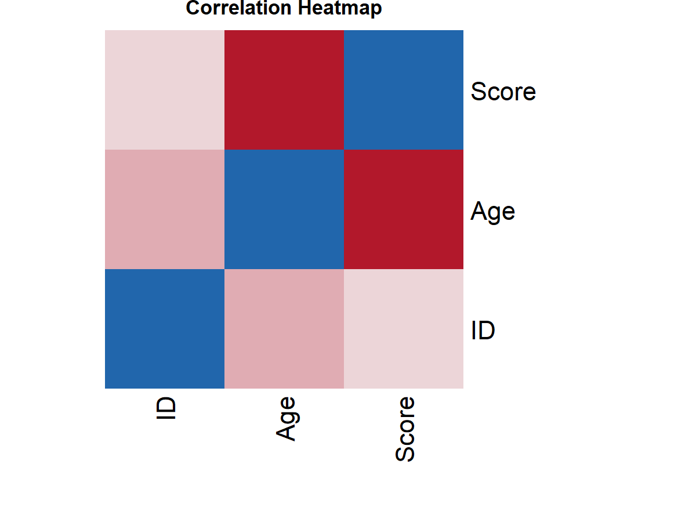

## Visualizations

### Score Comparison

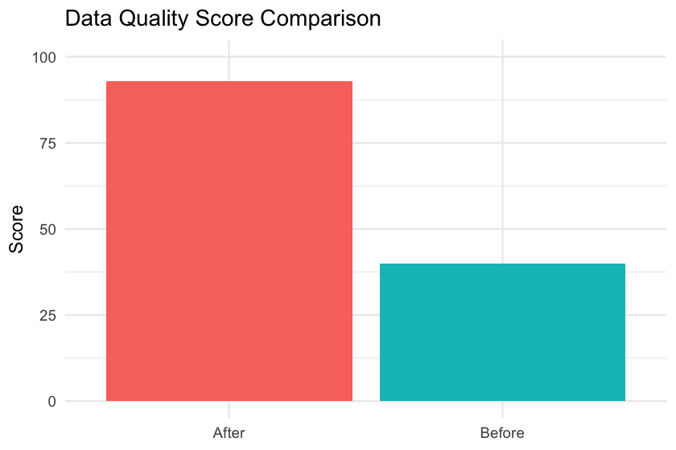

### Missing Values

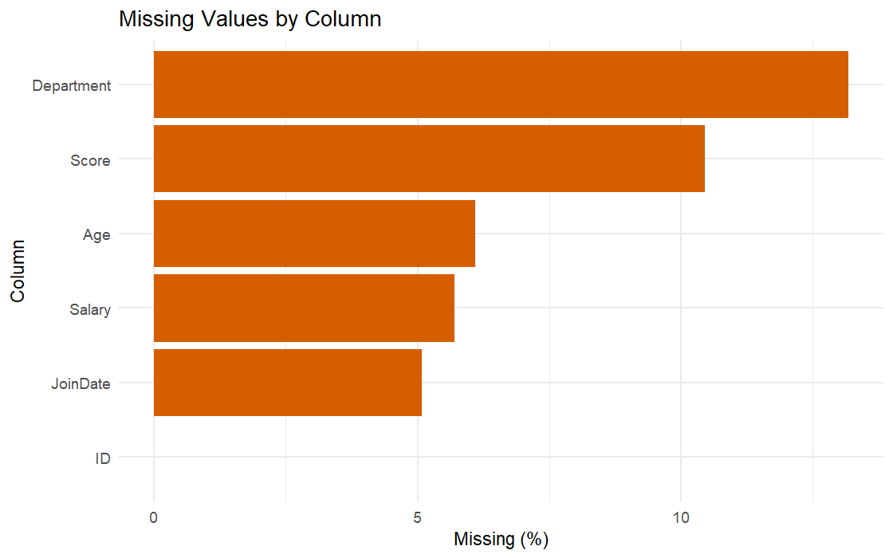

### Issue Summary

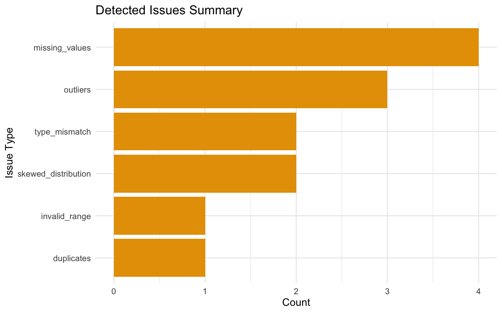

### Data Types

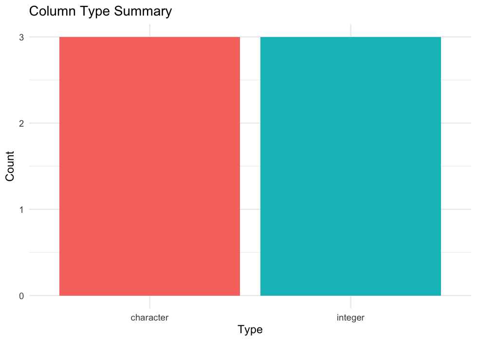

### Numeric Distributions

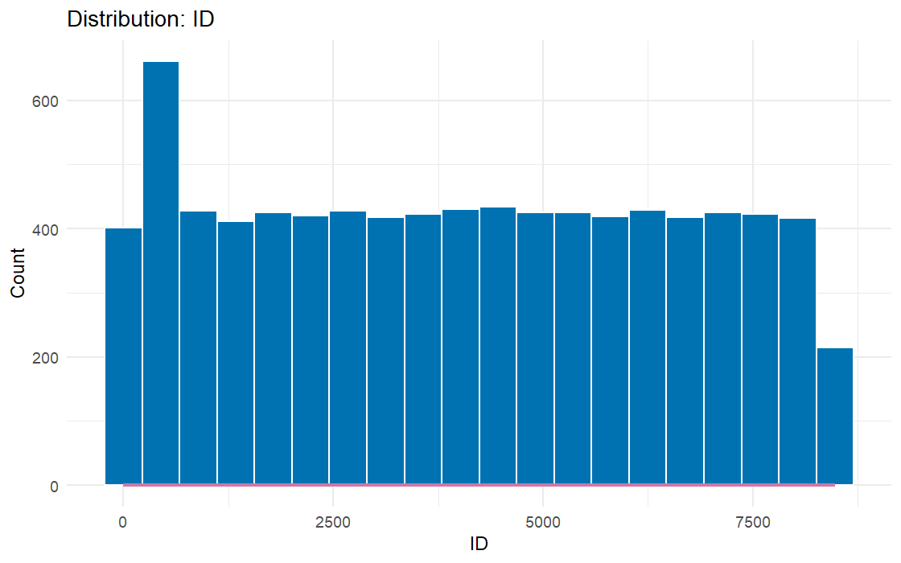
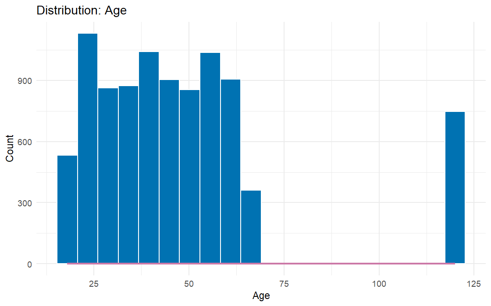
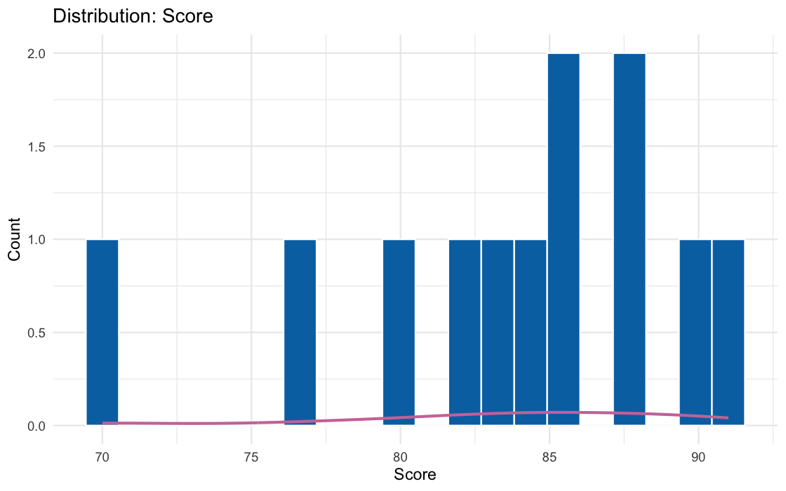

### Box Plots

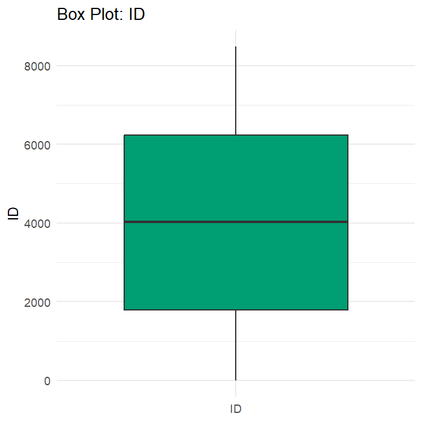
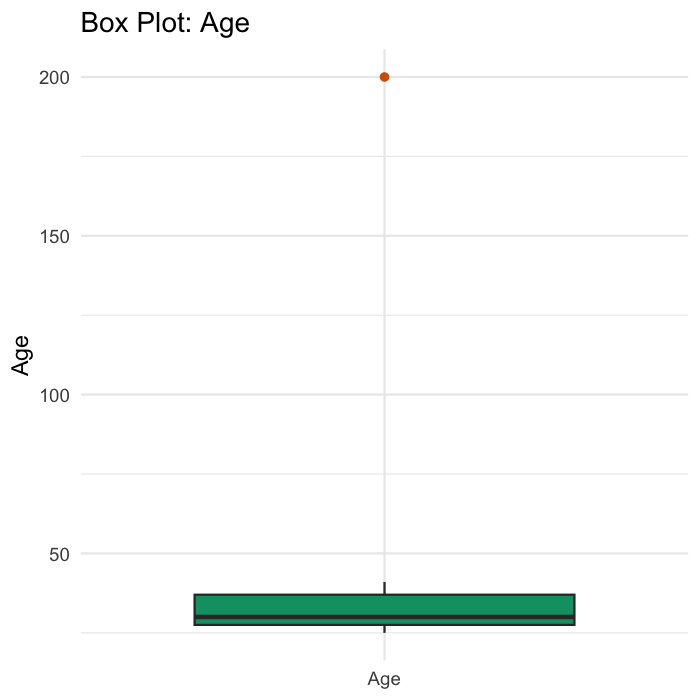
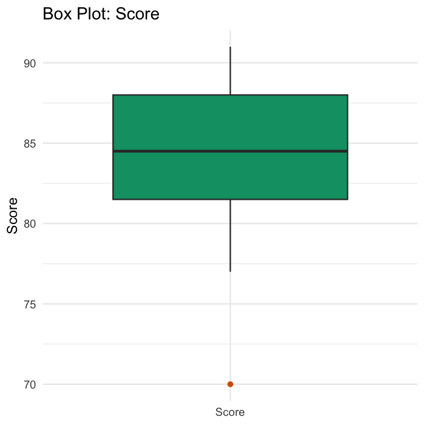

### Category Bars

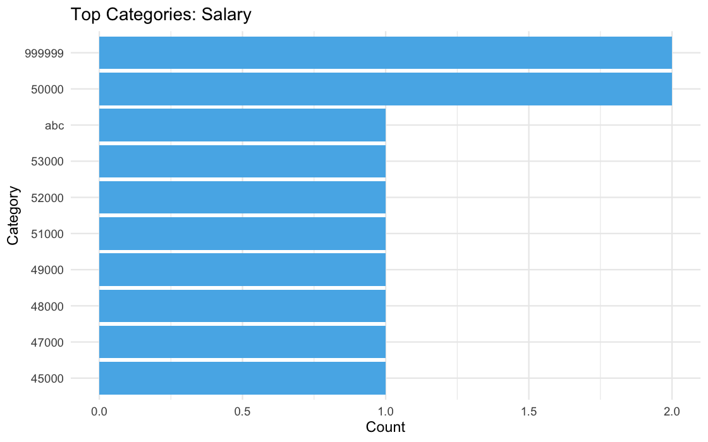
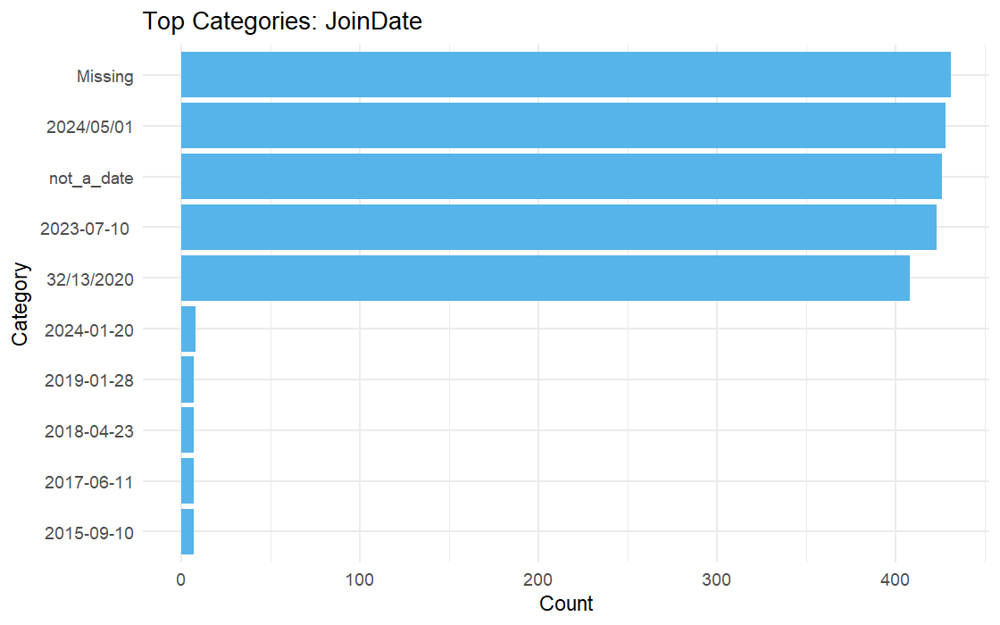
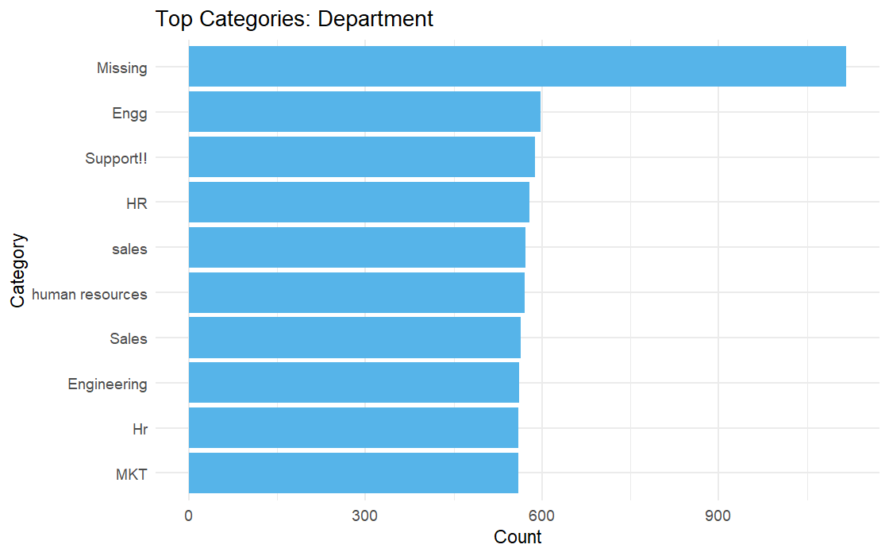

## LLM Suggestions

### Issue 1: Duplicate rows found: 1
- Explanation: The issue 'Duplicate rows found: 1' can reduce data quality or model reliability.
- Fix options: Remove duplicate rows
- Recommended: Remove duplicate rows
- Reason: Duplicate rows distort counts and should usually be removed.

### Issue 2: Column Age: Missing values 15.38%
- Explanation: The issue 'Column Age: Missing values 15.38%' can reduce data quality or model reliability.
- Fix options: Fill with median; Fill with mean; Fill with constant; Add missing indicator; Remove affected rows
- Recommended: Fill with median
- Reason: Median is robust to outliers and usually safer than the mean.

### Issue 3: Column Age: Outliers detected (1 values)
- Explanation: The issue 'Column Age: Outliers detected (1 values)' can reduce data quality or model reliability.
- Fix options: Cap outliers to IQR bounds; Winsorize extreme values; Robust scale using median and IQR; Remove outlier rows
- Recommended: Cap outliers to IQR bounds
- Reason: Capping keeps rows while reducing the distortion from extreme values.

### Issue 4: Column Age: Right-skewed distribution detected
- Explanation: The issue 'Column Age: Right-skewed distribution detected' can reduce data quality or model reliability.
- Fix options: Apply log transform; Apply square-root transform; Bin into quantiles; Standardize values; Robust scale values; Normalize to 0-1; Keep as-is
- Recommended: Apply log transform
- Reason: Log transform reduces skewness while preserving ordering.

### Issue 5: Column Age: Invalid range values found
- Explanation: The issue 'Column Age: Invalid range values found' can reduce data quality or model reliability.
- Fix options: Replace invalid values with NA; Replace invalid values with median; Clip values to valid range; Remove invalid rows
- Recommended: Replace invalid values with NA
- Reason: Replacing impossible values with NA avoids introducing false data.

### Issue 6: Column Salary: Missing values 7.69%
- Explanation: The issue 'Column Salary: Missing values 7.69%' can reduce data quality or model reliability.
- Fix options: Fill with median; Fill with mean; Fill with constant; Add missing indicator; Remove affected rows
- Recommended: Fill with median
- Reason: Median is robust to outliers and usually safer than the mean.

### Issue 7: Column Salary: Stored as text with non-numeric values present
- Explanation: The issue 'Column Salary: Stored as text with non-numeric values present' can reduce data quality or model reliability.
- Fix options: Convert to numeric; Remove invalid rows
- Recommended: Convert to numeric
- Reason: Converting the column preserves usable numeric values for analysis.

### Issue 8: Column Salary: Outliers detected (2 values)
- Explanation: The issue 'Column Salary: Outliers detected (2 values)' can reduce data quality or model reliability.
- Fix options: Cap outliers to IQR bounds; Winsorize extreme values; Robust scale using median and IQR; Remove outlier rows
- Recommended: Cap outliers to IQR bounds
- Reason: Capping keeps rows while reducing the distortion from extreme values.

### Issue 9: Column Salary: Right-skewed distribution detected
- Explanation: The issue 'Column Salary: Right-skewed distribution detected' can reduce data quality or model reliability.
- Fix options: Apply log transform; Apply square-root transform; Bin into quantiles; Standardize values; Robust scale values; Normalize to 0-1; Keep as-is
- Recommended: Apply log transform
- Reason: Log transform reduces skewness while preserving ordering.

### Issue 10: Column JoinDate: Stored as string but looks like date
- Explanation: The issue 'Column JoinDate: Stored as string but looks like date' can reduce data quality or model reliability.
- Fix options: Convert to Date; Convert to factor; Remove invalid rows
- Recommended: Convert to Date
- Reason: Date conversion enables validation and time-based analysis.

### Issue 11: Column Department: Missing values 15.38%
- Explanation: The issue 'Column Department: Missing values 15.38%' can reduce data quality or model reliability.
- Fix options: Fill with mode; Fill with constant; Add missing indicator; Remove affected rows
- Recommended: Fill with mode
- Reason: Mode imputation is a practical default for categorical columns.

### Issue 12: Column Score: Missing values 7.69%
- Explanation: The issue 'Column Score: Missing values 7.69%' can reduce data quality or model reliability.
- Fix options: Fill with median; Fill with mean; Fill with constant; Add missing indicator; Remove affected rows
- Recommended: Fill with median
- Reason: Median is robust to outliers and usually safer than the mean.

### Issue 13: Column Score: Outliers detected (1 values)
- Explanation: The issue 'Column Score: Outliers detected (1 values)' can reduce data quality or model reliability.
- Fix options: Cap outliers to IQR bounds; Winsorize extreme values; Robust scale using median and IQR; Remove outlier rows
- Recommended: Cap outliers to IQR bounds
- Reason: Capping keeps rows while reducing the distortion from extreme values.

## Fixes Applied

- Issue 1 on `dataset`: `remove_duplicates`
- Issue 2 on `Age`: `fill_missing_median`
- Issue 3 on `Age`: `cap_outliers`
- Issue 4 on `Age`: `log_transform`
- Issue 5 on `Age`: `replace_invalid_with_na`
- Issue 6 on `Salary`: `fill_missing_median`
- Issue 7 on `Salary`: `convert_to_numeric`
- Issue 8 on `Salary`: `cap_outliers`
- Issue 9 on `Salary`: `log_transform`
- Issue 10 on `JoinDate`: `convert_to_date`
- Issue 11 on `Department`: `fill_missing_mode`
- Issue 12 on `Score`: `fill_missing_median`
- Issue 13 on `Score`: `cap_outliers`

## Profile After Cleaning

- Rows: 12
- Columns: 6
- Duplicate rows: 0
- Total missing values: 1
- Max missing values in a row: 1
- Average missing values per row: 0.083
- Constant columns: None
- Near-zero variance columns: None
- Suggested correlated feature drops: None

### ID
- Type: integer
- Inferred kind: numeric
- Missing: 0 (0.00%)
- Unique values: 12
- Uniqueness ratio: 1
- Missing drop threshold exceeded: No
- Mean: 6.5
- Median: 6.5
- Min / Max: 1 / 12
- Q1 / Q3: 3.75 / 9.25
- P05 / P95: 1.55 / 11.45
- SD / Variance: 3.606 / 13
- Outliers: 0
- Zero / Negative values: 0 / 0
- Constant / Near-zero variance: FALSE / FALSE

### Age
- Type: numeric
- Inferred kind: numeric
- Missing: 0 (0.00%)
- Unique values: 10
- Uniqueness ratio: 0.833
- Missing drop threshold exceeded: No
- Mean: 3.433
- Median: 3.418
- Min / Max: 3.25809653802148 / 3.64087023492758
- Q1 / Q3: 3.359 / 3.481
- P05 / P95: 3.279 / 3.641
- SD / Variance: 0.121 / 0.015
- Outliers: 0
- Zero / Negative values: 0 / 0
- Constant / Near-zero variance: FALSE / FALSE

### Salary
- Type: numeric
- Inferred kind: numeric
- Missing: 0 (0.00%)
- Unique values: 9
- Uniqueness ratio: 0.75
- Missing drop threshold exceeded: No
- Mean: 10.818
- Median: 10.82
- Min / Max: 10.7144399907278 / 10.9151066458675
- Q1 / Q3: 10.794 / 10.844
- P05 / P95: 10.738 / 10.895
- SD / Variance: 0.053 / 0.003
- Outliers: 1
- Zero / Negative values: 0 / 0
- Constant / Near-zero variance: FALSE / FALSE

### JoinDate
- Type: Date
- Inferred kind: date
- Missing: 1 (8.33%)
- Unique values: 11
- Uniqueness ratio: 1
- Missing drop threshold exceeded: No
- Valid dates: 11
- Invalid dates: 0
- Min date / Max date: 2024-01-10 / 2024-07-11
- Date span (days): 183

### Department
- Type: character
- Inferred kind: categorical
- Missing: 0 (0.00%)
- Unique values: 6
- Uniqueness ratio: 0.5
- Missing drop threshold exceeded: No
- Mode: Sales
- Mode frequency: 6
- Dominance ratio: 0.5
- Rare categories: 4
- Entropy: 2.126
- Avg / Min / Max length: 7.583 / 2 / 25
- Whitespace-only values: 0
- Top values: Sales:6, Support:2, Engineering:1, HR:1, Marketing:1

### Score
- Type: numeric
- Inferred kind: numeric
- Missing: 0 (0.00%)
- Unique values: 11
- Uniqueness ratio: 0.917
- Missing drop threshold exceeded: No
- Mean: 83.667
- Median: 84
- Min / Max: 74 / 91
- Q1 / Q3: 81.5 / 86.5
- P05 / P95: 75.65 / 90.45
- SD / Variance: 4.997 / 24.97
- Outliers: 0
- Zero / Negative values: 0 / 0
- Constant / Near-zero variance: FALSE / FALSE

